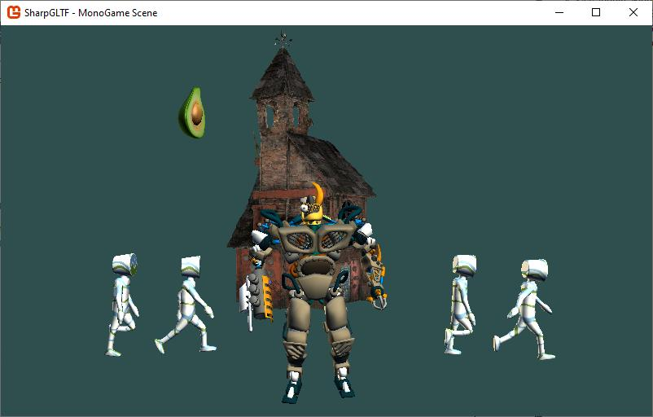

# MonoGame realtime rendering demo

Notes on the demo:

MonoGame typically preprocesses all graphics resources through its content pipeline, and all assets are converted to XNB files, which is what the runtime is able to load.

This is not the case of this demo; the glTF files are loaded at runtime without any preprocessing.

Also for simplicity, the demo uses the default in-built BasicEffect and SkinnedEffect shaders, which date from the years of DirectX9, so PBR rendering is not supported.

The project depends on [SharpGLTF.Runtime.MonoGame](../SharpGLTF.Runtime.MonoGame), which also depends on [SharpGLTF.Core](../../src/SharpGLTF.Core), that's everything you need to load and render glTF models into MonoGame.
