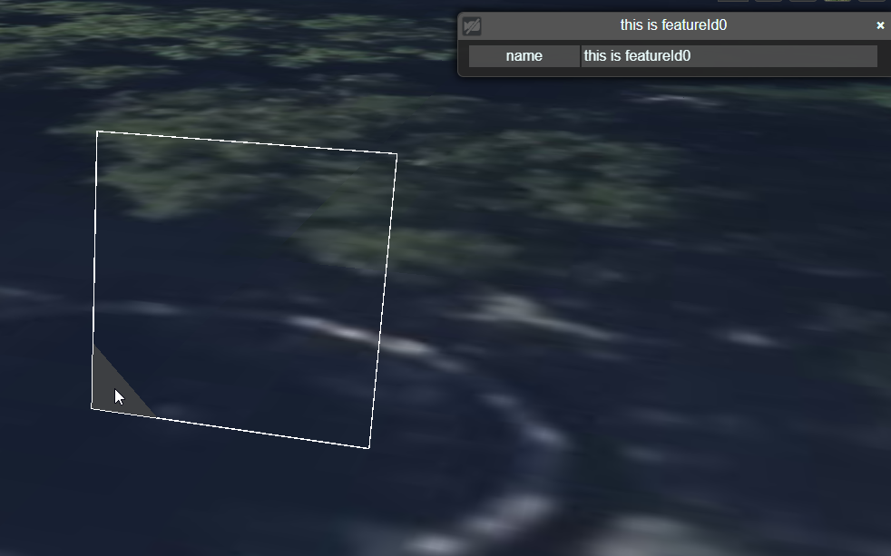
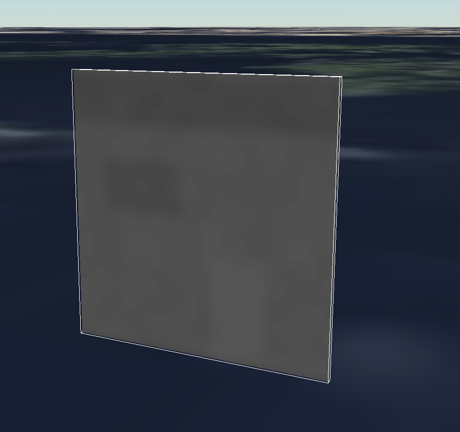

# SharpGLTF.Ext.3DTiles

This project contains the implementation of 3D Tiles support for SharpGLTF.

The following extensions are supported:

- CESIUM_primitive_outline

Specs: https://github.com/KhronosGroup/glTF/blob/main/extensions/2.0/Vendor/CESIUM_primitive_outline/README.md

Samples: https://github.com/CesiumGS/3d-tiles-samples/tree/main/glTF/CESIUM_primitive_outline/BoxPrimitiveOutline

- EXT_Mesh_Features

Specs: https://github.com/CesiumGS/glTF/tree/proposal-EXT_mesh_features/extensions/2.0/Vendor/EXT_mesh_features

Samples: https://github.com/CesiumGS/3d-tiles-samples/blob/main/glTF/EXT_mesh_features

- EXT_Instance_Features

Specs: https://github.com/CesiumGS/glTF/tree/3d-tiles-next/extensions/2.0/Vendor/EXT_instance_features

Samples: https://github.com/CesiumGS/3d-tiles-samples/tree/main/glTF/GpuInstancesMetadata

- Ext_Structural_Metadata

Specs: https://github.com/CesiumGS/glTF/tree/proposal-EXT_structural_metadata/extensions/2.0/Vendor/EXT_structural_metadata

Samples: https://github.com/CesiumGS/3d-tiles-samples/tree/main/glTF/EXT_structural_metadata

Not supported: External schema and min/max/scale.offset properties for StructuralMetadataClassProperty and PropertyAttributeProperty

## Unit testing 

## Reading 3D Tiles glTF files

The unit test project contains a set of glTF files that are used to test the implementation of the extensions. The glTF files 
are obtained from https://github.com/CesiumGS/3d-tiles-validator/tree/main/specs/data/gltfExtensions.

## Writing 3D Tiles glTF files

See the unit test project for examples of how to write glTF files with the extensions.

The unit tests writes glTF files like the samples from https://github.com/CesiumGS/3d-tiles-samples/tree/main/glTF

## Validation

For reading glTF files with 3D Tiles extensions the files should be valid according to a validator. The validator is available at https://github.com/CesiumGS/3d-tiles-validator

When writing glTF files with 3D Tiles extensions the resulting files should be valid according to the validator. 

## Sample code 

### Reading a 3D Tiles glTF file with metadata

```csharp
    var model = ModelRoot.Load("sample.gltf");
    var structuralMetadataExtension = model.GetExtension<EXTStructuralMetadataRoot>();
    var meshFeaturesExtension = model.LogicalMeshes[0].Primitives[0].GetExtension<MeshExtMeshFeatures>();
```

## Writing a 3D Tiles glTF file with attribute metadata

In the following sample a glTF with 1 triangle is created. The triangle contains metadata with
a name column. The name column is set to "this is featureId0". The triangle is assigned featureId 0.

```csharp
    int featureId = 0;
    var material = MaterialBuilder.CreateDefault().WithDoubleSide(true);

    var mesh = new MeshBuilder<VertexPositionNormal, VertexWithFeatureId, VertexEmpty>("mesh");
    var prim = mesh.UsePrimitive(material);

    var vt0 = VertexBuilder.GetVertexWithFeatureId(new Vector3(0, 0, 0), new Vector3(0, 0, 1), featureId);
    var vt1 = VertexBuilder.GetVertexWithFeatureId(new Vector3(1, 0, 0), new Vector3(0, 0, 1), featureId);
    var vt2 = VertexBuilder.GetVertexWithFeatureId(new Vector3(0, 1, 0), new Vector3(0, 0, 1), featureId);

    prim.AddTriangle(vt0, vt1, vt2);
    var scene = new SceneBuilder();
    scene.AddRigidMesh(mesh, Matrix4x4.Identity);
    var model = scene.ToGltf2();

    var rootMetadata = model.UseStructuralMetadata();
    var schema = rootMetadata.UseEmbeddedSchema("schema_001");

    var schemaClass = schema.UseClassMetadata("triangles");

    var nameProperty = schemaClass
        .UseProperty("name")
        .WithStringType();

    var propertyTable = schemaClass
        .AddPropertyTable(1);

    propertyTable
        .UseProperty(nameProperty)
        .SetValues("this is featureId0");

    foreach (var primitive in model.LogicalMeshes[0].Primitives)
    {
        var featureIdAttribute = new FeatureIDBuilder(1, 0, propertyTable);
        primitive.AddMeshFeatureIds(featureIdAttribute);
    }

    model.SaveGLTF(@"sample.gltf");
```

3D Tiles specific parts in the resulting glTF:

```
 "extensions": {
    "EXT_structural_metadata": {
      "propertyTables": [
        {
          "class": "triangles",
          "count": 1,
          "properties": {
            "name": {
              "stringOffsets": 3,
              "values": 2
            }
          }
        }
      ],
      "schema": {
        "classes": {
          "triangles": {
            "properties": {
              "name": {
                "type": "STRING"
              }
            }
          }
        },
        "id": "schema_001"
      }
    }
  },
  "extensionsUsed": [
    "EXT_structural_metadata",
    "EXT_mesh_features"
  ],
  "meshes": [
    {
      "name": "mesh",
      "primitives": [
        {
          "extensions": {
            "EXT_mesh_features": {
              "featureIds": [
                {
                  "attribute": 0,
                  "featureCount": 1,
                  "propertyTable": 0
                }
              ]
            }
          },
          "attributes": {
            "POSITION": 0,
            "NORMAL": 1,
            "_FEATURE_ID_0": 2
          },
          "indices": 3,
          "material": 0
        }
      ]
    }
  ],

  ```

  Sample loaded in Cesium:


  

  ## Writing a 3D Tiles glTF file with texture metadata

  In the following sample a glTF with 2 triangles is created. For visualizing the triangles a texture of a building is used.  
  A second texture is used containing metadata for storing the metadata values:

  - R channel: Inside temperature

  - G channel: Outside temperature

  - B channel: Humidity

  Using a shader in the client application the metadata values can be visualized.

  ```csharp

    var img0 = "iVBORw0KGgoAAAANSUhEUgAAAQAAAAEACAYAAABccqhmAAAIvklEQVR42u3csW5URxsG4BHBRRoklxROEQlSRCJCKShoXFJZiDSpQEqX2pYii8ZVlDZF7oNcAAURDREdpCEXQKoIlAKFEE3O4s0KoV17zxm8Z+Z8j6zvj6Nfj7Q663k968y8aXd3NxtjYk6a/U9OafDwPN+uFwA8LwA8QJ4XAO/Mw26+6Garm6vd/NbzBfA8X79fGQCXuvll/v1P3XzZ8wXwPF+/X+sjwL/zJBm6BeF5vk6/VgC8nG8nhr4Anufr9GsFwA/d/FzwAnier9OfGgC/d/NdwV8heZ6v158YAH908203/wx8ATzP1+1XBsDsL4hfdfNq4H+H5Hm+fr8yAD6Z/Z/vTZ8XwPN8/d5JQJ53EtAD5HkB4AHyfLwAMMboA5CgPO8jgAfI8wLAA+R5fQDuU/O8PgD3qXleH4D71DyvD8B9ap7XB+A+Nc/rA+B5Xh8Az/P6AHie1wfA87w+AJ7nHQXmeV4A8DyvD8AYow+A53kfAXieFwA8z+sD4HleHwDP8/oAeJ7XB8DzvD4Anuf1AfA8rw+A53l9ADzP6wPgeV4fAM/zjgLzPC8AeJ7XB2CMOaEPIBV88TzfrhcAPC8APECeFwDvfj3p5lI3W91c7eZhzxfA83z1fnUA3O7mx/n333fzdc8XwPN89X51AHzazd/z7//s5vOeL4Dn+er96gD4+JR/P+0F8DxfvV8dAOm9f9/q+QJ4nq/e2wHwvB3Akq/Punk5//6v+V8U+7wAnuer96sD4Jv5Xw///yvi7Z4vgOf56v3qAPh1/pfEj+bp8aTnC+B5vnrvJCDPOwnoAfK8APAAeT5eABhj9AFIUJ73EcAD5HkB4AHyfOAAcJ+a5/UBLE4SuU/N85Pz+gB4PrB3G5DnA3t9ADwf2NsB8LwdwJIv96l5fvJeHwDPB/b6AHg+sHcSkOedBPQAeV4AeIA8Hy8AjDH6AMZLsJQHD+83IN/6RwABIAB4ASAABABfSwBs8j7zkh/sK1dyfvw459evc370KOfLl/stoFB+7PePb9bX0Qew5Af76dOcb906/v7OnePF0GcBhfJjv398s76OPoA1trqz34QlW+hJ+7HfP75ZX8dtwBN+8M+dy/nu3Zzv3Ru2gEL4sd8/vllfRx/Aih/+8+dzfvEi5zdvcr55s/8CCuPHfv/4Zn31O4DZ3LiR8/Pnw7fQk/d+A/IffAewyfvM/gbw4f8G4D4830wfwJIf7GfPjv9T2Oz769dzvn+/3wIK5cd+//hmfR19AEt+sK9dO/5PYbPffA8e5HzxYr8FFMqP/f7xzXonAZ0E5J0EFAACgBcAAkAA8PECwBijD8AOwA6A9xFAAAgAXgAIAAHABw4AfQD6AHh9AGkT95n1AegD4Efx+gD0AfCBvT4AfQC824Bp3PvM+gD0AfCjeH0A+gB4O4A07n1mfwPQB8CP4vUB6APgA3t9APoA+MDeSUAnAXknAQWAAOAFgAAQAHy8ADDG6AOwA7AD4H0EEAACgBcAAkAA8IEDQB+APgBeH0DaxH1mfQD6APhRvD4AfQB8YK8PQB8A7zZgGvc+sz4AfQD8KF4fgD4A3g4gjXuf2d8A9AHwo3h9APoA+MBeH4A+AD6wdxLQSUDeSUABIAB4ASAABAAfLwCMMfoAJCjP+wjgAfK8APAAeT5wALhPzfP6ABYnidyn5vnJ+eQ+Nc/H9cltKp6P65P71Dwf19sB8LwdwJIv96l5fvI+uU/N83F9cp+a5+N6JwF53klAD5DnBYAHyPPxAsAYow9AgvK8jwAeIM8LAA+Q5wMHgPvUPK8PYHGSyH1qnp+c1wfA84G924A8H9jrA+D5wN4OgOftAJZ8uU/N85P3+gB4PrDXB8Dzgb2TgDzvJKAHyPMCwAPk+XgBYIzRByBB+UH+6Oho8NTgfQSwAHgBIAAsAF4ACIDjL/ep+TX9qsV1eHiYt7e3By/gTfnI758+AL7YL1tYBwcHeWdn5+2llCELeJM+8vunD4Av9ssW1oULF/Le3t7gBbxJH/n9cxuQL/bLFtb+/v7bfw5dwJv0kd8/fQB8sT9pgQ1dwJv0kd8/OwD+THYAzQeAPoDkPjW/lp9kAOgDSO5T82v5SQaAPoDkPjW/lp9kAOgDcBKOdxLQUWALgBcAAsAC4AXARAPAGKMPwG9A3g7ARwALgBcAAsAC4AVA4ABwH57XB6APYHGSyH14vkcA6ANI+gD4GF4fQLvebUC+2OsDaNfrA+CLvT6Adr0dAH8mOwB9AK3vANyH5/UBTP790wfAF3t9AO16fQB8sdcH0K53EpB3EtBJQAuAFwACwALgBUC8ADDG6APwG5C3A/ARwALgBYAAsAB4ARA4ANyH5/UB6ANYnCRyH57vEQD6AJI+AD6G1wfQrncbkC/2+gDa9foA+GKvD6BdbwfAn8kOQB9A6zsA9+F5fQCTf//0AfDFXh9Au14fAF/s9QG0650E5J0EdBLQAuAFgACwAHgBEC8AjDH6APwG5O0AfASwAHgBIAAsAF4ABA4A9+F5fQD6ABYnidyH53sEgD6ApA+Aj+H1AbTr3Qbki70+gHa9PgC+2OsDaNfbAfBnsgPQB9D6DsB9eF4fwOTfP30AfLHXB9Cu1wfAF3t9AO16JwF5JwGdBLQAeAEgACwAXgDECwBjjD4AvwF5OwAfASwAXgAIAAuAFwCBA8B9eF4fgD6AxUki9+H5HgGgDyDpA+BjeH0A7Xq3Aflirw+gXa8PgC/2+gDa9XYA/JnsAPQBtL4DcB+e1wcw+fdPHwBf7PUBtOv1AfDFXh9Au95JQN5JQCcBLQBeAAgAC4AXAPECwBijD8BvQN4OwEcAC4AXAALAAuAFQOAAcB+e1wegD2Bxksh9eL5HAOgDSPoA+BheH0C73m1AvtjrA2jX6wPgi70+gHa9HQB/JjsAfQCt7wDch+f1AUz+/dMHwBd7fQDten0AfLHXB9CudxKQdxLQSUALgBcAAsAC4AVAqPfvPyVxz6xUBN7bAAAAAElFTkSuQmCC";
    var imageBytes0 = Convert.FromBase64String(img0);
    var imageBuilder0 = ImageBuilder.From(imageBytes0);

    var img1 = "iVBORw0KGgoAAAANSUhEUgAAABAAAAAQCAYAAAAf8/9hAAABLUlEQVR42mVSSxbDIAh0GzUxKZrmCF3n/oerIx9pupgHIswAGtblE7bIKN0vqSOyXSOjPLAtktv9sCFxmcXj7EgsFj8zN00yYxrBZZJBRYk2LdC4WCDUfAdab7bpDm1lCyBW+7lpDnyNS34gcTQRltTPbAeEdFjcSQ0X9EOhGPYjhgLA7xh3kjxEEpMj1qQj7iAzAYoPELzYtuwK02M06WywAFDfX1MdJEoOtSZ7Allz1mYmWZDNL0pNF6ezu9jsQJUcNK7qzbWvMdSYQ8Jo7KKK8/uo4dxreHe0/HgF2/IqBen/za+Di69Sf8cZz5jmk+hcuhdd2tWLz8IE5MbFnRWT+yyU5vZJRtAOqlvq6MDeOrstu0UidsoO0Ak9xGwE+67+34salNEBSCxX7Bexg0rbq6TFvwAAAABJRU5ErkJggg==";
    var imageBytes1 = Convert.FromBase64String(img1);
    var imageBuilder1 = ImageBuilder.From(imageBytes1);

    var material = MaterialBuilder
        .CreateDefault()
        .WithMetallicRoughnessShader()
        .WithBaseColor(imageBuilder0, new Vector4(1, 1, 1, 1))
        .WithDoubleSide(true)
        .WithAlpha(Materials.AlphaMode.OPAQUE)
        .WithMetallicRoughness(0, 1)
        .WithMetallicRoughness(imageBuilder1);

    var mesh = VBTexture1.CreateCompatibleMesh("mesh");
    var prim = mesh.UsePrimitive(material);
    prim.AddTriangle(
        new VBTexture1(new VertexPosition(0, 0, 0), new Vector2(0, 1)),
        new VBTexture1(new VertexPosition(1, 0, 0), new Vector2(1, 1)),
        new VBTexture1(new VertexPosition(0, 1, 0), new Vector2(0, 0)));

    prim.AddTriangle(
        new VBTexture1(new VertexPosition(1, 0, 0), new Vector2(1, 1)),
        new VBTexture1(new VertexPosition(1, 1, 0), new Vector2(1, 0)),
        new VBTexture1(new VertexPosition(0, 1, 0), new Vector2(0, 0)));

    var scene = new SceneBuilder();
    scene.AddRigidMesh(mesh, Matrix4x4.Identity);
    var model = scene.ToGltf2();

    // --------------------------------------------------------------

    var rootMetadata = model.UseStructuralMetadata();
    var schema = rootMetadata.UseEmbeddedSchema("SimplePropertyTextureSchema");

    // define schema 

    var exampleMetadataClass = schema
        .UseClassMetadata("buildingComponents")
        .WithName("Building properties");

    exampleMetadataClass
        .UseProperty("insideTemperature")
        .WithName("Inside temperature")
        .WithUInt8Type();

    exampleMetadataClass
        .UseProperty("outsideTemperature")
        .WithName("Outside temperature")
        .WithUInt8Type();

    exampleMetadataClass
        .UseProperty("insulation")
        .WithName("Insulation Thickness")
        .WithUInt8Type()
        .WithNormalized(true);

    // define texture property

    var buildingPropertyTexture = exampleMetadataClass.AddPropertyTexture();

    buildingPropertyTexture.CreateProperty("insideTemperature", model.LogicalTextures[1], new int[] { 0 });
    buildingPropertyTexture.CreateProperty("outsideTemperature", model.LogicalTextures[1], new int[] { 1 });
    buildingPropertyTexture.CreateProperty("insulation", model.LogicalTextures[1], new int[] { 2 });

    // assign to primitive

    var primitive = model.LogicalMeshes[0].Primitives[0];
    primitive.AddPropertyTexture(buildingPropertyTexture);

    model.SaveGLTF(@"sample.gltf");

```

3D Tiles specific parts in the resulting glTF:

```
  "extensions": {
    "EXT_structural_metadata": {
      "propertyTextures": [
        {
          "class": "buildingComponents",
          "properties": {
            "insideTemperature": {
              "index": 1,
              "channels": [
                0
              ]
            },
            "outsideTemperature": {
              "index": 1,
              "channels": [
                1
              ]
            },
            "insulation": {
              "index": 1,
              "channels": [
                2
              ]
            }
          }
        }
      ],
      "schema": {
        "classes": {
          "buildingComponents": {
            "name": "Building properties",
            "properties": {
              "insideTemperature": {
                "componentType": "UINT8",
                "name": "Inside temperature",
                "type": "SCALAR"
              },
              "outsideTemperature": {
                "componentType": "UINT8",
                "name": "Outside temperature",
                "type": "SCALAR"
              },
              "insulation": {
                "componentType": "UINT8",
                "name": "Insulation Thickness",
                "normalized": true,
                "type": "SCALAR"
              }
            }
          }
        },
        "id": "SimplePropertyTextureSchema"
      }
    }
  },
"meshes": [
    {
      "name": "mesh",
      "primitives": [
        {
          "extensions": {
            "EXT_structural_metadata": {
              "propertyTextures": [
                0
              ]
            }
          },
          "attributes": {
            "POSITION": 0,
            "TEXCOORD_0": 1
          },
          "indices": 2,
          "material": 0
        }
      ]
    }
  ],
```

Shader code for visualizing the metadata:

```
// Create a custom (fragment) shader that accesses the metadata value with the
// given property name, normalizes it to a value in [0,1] based on the given
// source range, and uses that value as the brightness for the fragment.
function createShader(propertyName, sourceMin, sourceMax) {
  const shader = new Cesium.CustomShader({
    fragmentShaderText: `
      void fragmentMain(FragmentInput fsInput, inout czm_modelMaterial material)
      {
        float value = float(fsInput.metadata.${propertyName});
        float range = float(${sourceMax}) - float(${sourceMin});
        float brightness = (value - float(${sourceMin})) / range;
        material.diffuse = vec3(brightness);
      }
    `,
  });
  return shader;
}

tileset.customShader = createShader("insideTemperature", 0.0, 255.0);
```

Sample loaded in Cesium:




